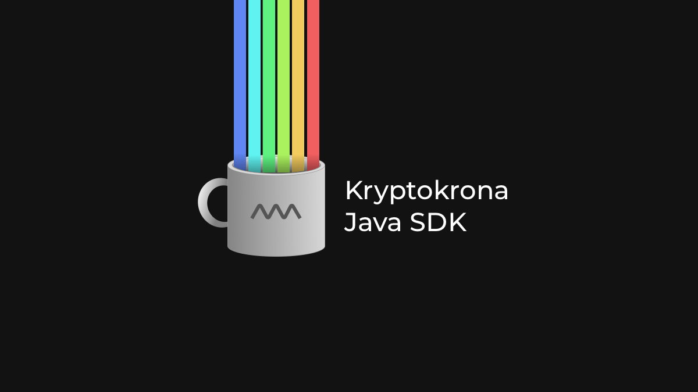

Kryptokrona SDK in Java for building decentralized private communication and payment systems.

<p>
<a href="https://chat.kryptokrona.org">
    
</a>
<a href="https://github.com/kryptokrona/kryptokrona-sdk/issues">
    
</a>
<a href="https://github.com/kryptokrona/kryptokrona-sdk/pulls">
    
</a>
<a href="https://github.com/kryptokrona/kryptokrona-sdk/commits/main">
    
</a>
<a href="https://github.com/kryptokrona/kryptokrona-sdk/graphs/contributors">
    
</a>
<a href="https://github.com/kryptokrona/kryptokrona-sdk/blob/main/LICENSE">
    
</a>
<a href="https://twitter.com/kryptokrona">
    
</a>
</p>

## Technologies

- OpenJDK 17 (LTS)
- Gradle
- RxJava
- Google HTTP Client
- JUnit5
- Lombok
- JaCoCo
- Checkstyle
- PMD
- Spotbugs
- gson
- IPAddress

## Installation

To get it up and running locally you need to clone the repository with the following command:

Using SSH:

- `git clone --recursive git@github.com:kryptokrona/kryptokrona-sdk.git`

Using HTTPS:

- `git clone --recursive https://github.com/kryptokrona/kryptokrona-sdk.git`

This is important if we want to have the sdk-examples submodule. If not, you should not need to do this recursive cloning.

## Tests

We use unit tests, static code analysis and code coverage to ensure that we always write
quality code. We can either run them seperatly to view the status or run everything with
one command:

- `./gradlew test`

### Unit Testing

We are using JUnit 5 to conduct our unit tests. All tests are located under `src/test`.

To run unit tests run:

- `./gradlew test`

An HTML file will be generated so that we can open up in our browser to
view in more detail the test results. The file is located in `build/reports/tests/test/index.html`

### Static Code Analysis

The static code analysis tool used in this project is cpd. All configuration for the static code analysis can be found 
in `gradle/static-code-analysis`. To run the static code analysis:

- `./gradlew checkStyleMain`
- `./gradlew cpdCheck`
- `./gradlew pmdMain`
- `./gradlew spotbugsMain`

HTML files will be generated so that we can open up in our browser. The files 
are located in:

- `build/reports/checkstyle/main.html`
- `build/reports/spotbugs/main/spotbugs.html`
- `build/reports/pmd/main.html`

### Code Coverage

The code coverage tool of this project is JaCoCo. To run:

- `./gradlew jacacoTestReport`

An HTML file will be generated so that we can open up in our browser. The file
is located in `build/kryptokrona-sdk-report/index.html`

## Build

We are using Gradle as the build tool for this project. The easiest way to build if you are not running IntelliJ is to run
the command:

- `./gradlew build`

This command will also run all the unit tests at the same time so if you want to avoid that, just run the command:

- `./gradlew assemble`

There might be some trouble doing this multiple times, then we need to do a cleanup:

- `./gradlew clean`

If you want to visualize how the Gradle tasks are run in what order 
by their dependencies. Run the command:

- `./gradlew taskTree`

To list all the tasks provided in this project run:

- `./gradlew tasks`

**Tip:** you can also run the commands in short form e.g. `./gradlew tT` or `./gradlew jTR` that is 
for the jacocoTestReport task.

### CI/CD

We also have a CI/CD flow for this project that will assemble the code, run static code analysis,
run unit tests, run code coverage, and save the artifact of the build to GitHub Packages.

This artifact can then be downloaded and imported manually if that need exists for the project. Instructions
on how to do this can be read in the installation instructions above.

Whenever you submit a pull request a pipeline will run with the following steps:

- Assemble
- Static Code Analysis
- Unit Test
- Code Coverage

The only thing different here from the main pipeline that runs is that we do not publish an artifact to
GitHub Packages.

## GitHub Pages

We use GitHub Pages for displaying the documentation of this project in addition to this README file. Go to https://kryptokrona.github.io/kryptokrona-sdk/
to view all the links to the releases and other additional information.

### Javadoc

We use Javadoc for our in depth documentation that is available on GitHub Pages. To generate javadoc and getting these into
version control so it can get deployed we need to run:

- `./gradlew copyJavaDoc`

This has a dependency to javadoc gradle task so we don't need to run two commands.

NOTE: The files will be located under `docs/<version>` and the version is picked up by what it says inside the file 
`gradle.properties`.

## Contribute

If you would like to contribute to this project there is two ways:

- Send a pull request
- Donate to XKR address

### Pull request

We appreciate all contributions whether it be small changes such as documentation of source code to major improvement of code.

The easiest way is to make a fork and then make a pull request into our develop branch. To make the PR go through make sure to include this information:

```
What does this PR do?

Why are these changes required?

This PR has been tested using (e.g. Unit Tests, Manual Testing):

Extra details?
```

### Donate

XKR: SEKReXXU9aJPiwjX2XkpbK8ACMWbUNXcYPxUVSiUYpNdhj8Z2snEy8CjjorZUNyswQNfzAmVWuGksU72Sf3Kq79Zd3fJWHq4Nyx


## Contributors

<!-- ALL-CONTRIBUTORS-LIST:START - Do not remove or modify this section -->
<!-- prettier-ignore-start -->
<!-- markdownlint-disable -->
<table>
  <tr>
    <td align="center"><a href="https://github.com/mjovanc"><br /><sub><b>Marcus Cvjeticanin</b></sub></a><br /></td>
   </td>
  </tr>
  </tr>

</table>

## License

The license is GPL-3.0 License.